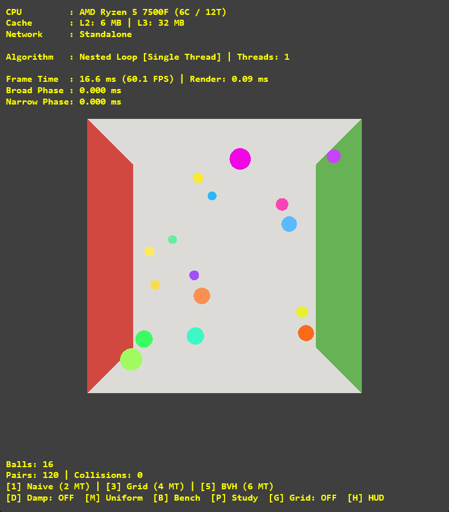
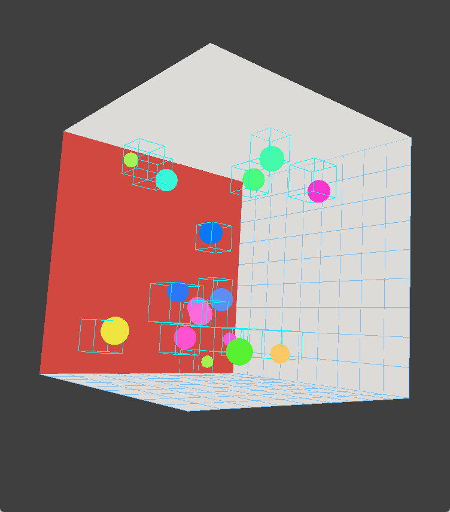
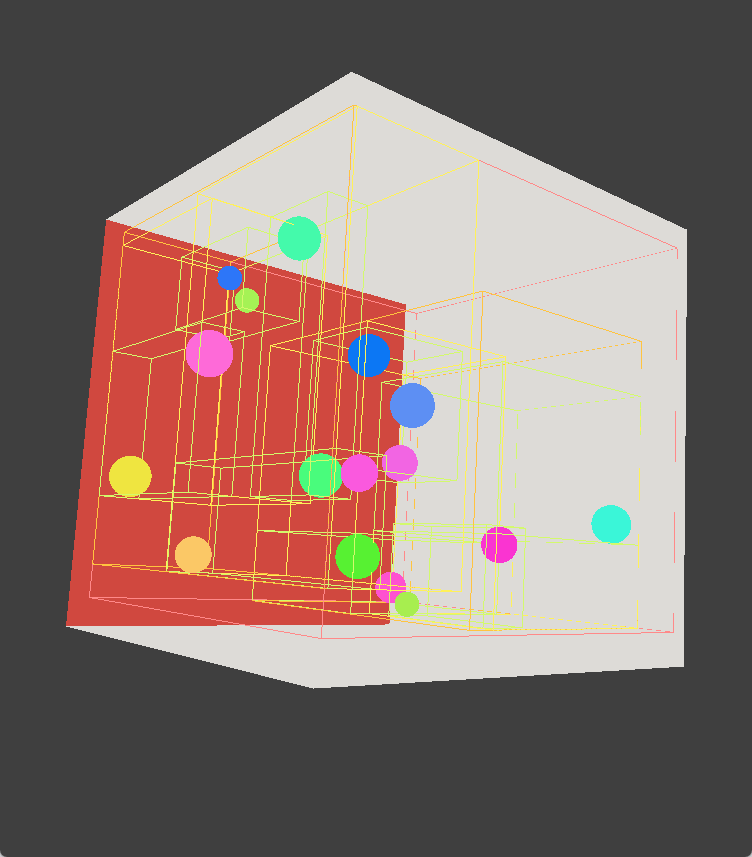

# Parallel Collision Lab

| 기본 화면 · Default | Uniform Grid | BVH |
| :---: | :---: | :---: |
|  |  |  |

C++과 DirectX 11을 기반으로 실시간 구체 충돌, CPU 병렬 처리, 네트워크 물리 동기화를 실험한 프로젝트입니다.

해당 실험에 쓰인 코넬 박스 속 튕기는 구들은 그래픽스 수업 과제에 영향을 받았으나 코드는 가져오지 않았습니다.

### 주요 기능

- Nested Loop, Uniform Grid, BVH의 단일·멀티스레드 버전으로 구성된 6개 충돌 솔버
- `std::thread` 작업 스레드 수 조절, 구체 16~8,192개, 균일·혼합 크기 및 감쇠·수면 상태
- Grid·BVH 시각화, 와이어프레임, Direct2D/DirectWrite 프로파일링 HUD
- Winsock2 UDP 기반 서버 권한 모델, 클라이언트 이동 예측, 지연·패킷 손실 시뮬레이션

### 단축키

| 입력 | 동작 |
| --- | --- |
| `1`~`6` / `F1`~`F6` | 솔버 선택 |
| `Space` / `R` | 일시 정지·재개 / 구체 재생성 |
| `F` / `M` / `D` | 구체 개수(16/8,192) / 크기 모드 / 감쇠 전환 |
| `+` / `−` | 구체 1개 증가·감소, `Shift`를 누르면 16개 |
| `[` / `]` | 스레드 수 1 감소·증가, `Shift`를 누르면 4 (범위 1~64) |
| 마우스 왼쪽 드래그 | 카메라 회전 |
| 마우스 오른쪽 드래그 또는 `Shift` + 왼쪽 드래그 | 확대·축소 |
| `Home` | 카메라 초기화 |
| `W` / `G` / `H` | 와이어프레임 / Grid·BVH / HUD 표시 전환 |
| `Page Up` / `Page Down` / `V` | BVH 표시 깊이 조절 / 표시 모드 순환 |
| 방향키 / `Q`, `E` | 클라이언트 구체를 X·Y축 / −Z·+Z축으로 이동 |
| `L` / `F7` | 모의 지연 순환: 0/50/100/200ms |
| `K` / `F8` | 모의 패킷 손실률 순환: 0/5/10/20% |
| `Esc` | 종료 |

### 네트워크 모드

```powershell
# 서버
.\ParallelCollisionLab.exe -server -port 32768

# 클라이언트 — 추가 클라이언트도 같은 명령으로 실행
.\ParallelCollisionLab.exe -client -ip 127.0.0.1 -port 32768
```

인수 없이 실행하면 독립 실행 모드로 동작합니다. 클라이언트에는 사용 가능한 지구·화성·UV Map 조작 슬롯이 할당되며, 모두 사용 중이면 관전자로 접속합니다. 다른 컴퓨터에서 접속할 때는 서버의 IPv4 주소를 지정하고 방화벽에서 해당 UDP 포트를 허용합니다.

### 프로젝트 구조

```text
ParallelCollisionLab/
├── main.cpp    # 초기화 및 메인 루프
├── Collision/  # 충돌 솔버 및 충돌 응답
├── Core/       # 수학 연산, 구체, 시뮬레이션, 설정
├── Network/    # UDP 서버·클라이언트, 프로토콜, 네트워크 시뮬레이터
├── Renderer/   # DirectX 11, HLSL, HUD, 카메라
├── Resource/   # 행성 텍스처
└── Window/     # Win32 창 및 입력 처리
```

---

A Windows desktop application for exploring real-time sphere collisions, CPU parallelism, and networked physics, built with C++ and DirectX 11.

### Features

- Six collision solvers: single-threaded and multithreaded versions of Nested Loop, Uniform Grid, and BVH.
- Adjustable `std::thread` workers and 16–8,192 spheres, with uniform/mixed sizes, damping, and sleeping.
- Grid/BVH visualization, wireframe rendering, and a Direct2D/DirectWrite profiling HUD.
- Winsock2 UDP networking with server authority, client prediction, and simulated latency/packet loss.

### Controls

| Input | Action |
| --- | --- |
| `1`–`6` / `F1`–`F6` | Select solver |
| `Space` / `R` | Pause/resume / regenerate spheres |
| `F` / `M` / `D` | Toggle sphere count (16/8,192) / size mode / damping |
| `+` / `−` | Add/remove 1 sphere; `Shift` for 16 |
| `[` / `]` | Decrease/increase threads by 1; `Shift` for 4 (1–64) |
| Left mouse drag | Rotate camera |
| Right mouse drag or `Shift` + left drag | Zoom |
| `Home` | Reset camera |
| `W` / `G` / `H` | Toggle wireframe / grid or BVH / HUD |
| `Page Up` / `Page Down` / `V` | Adjust BVH display depth / cycle display mode |
| Arrow keys / `Q`, `E` | Move the client's assigned sphere along X/Y / −Z,+Z |
| `L` / `F7` | Cycle simulated latency: 0/50/100/200 ms |
| `K` / `F8` | Cycle simulated packet loss: 0/5/10/20% |
| `Esc` | Exit |

### Network mode

```powershell
# Server
.\ParallelCollisionLab.exe -server -port 32768

# Client — repeat for additional clients
.\ParallelCollisionLab.exe -client -ip 127.0.0.1 -port 32768
```

Without arguments, the app runs standalone. Clients receive available Earth, Mars, or UV Map control slots; additional clients become spectators when all slots are occupied. For remote connections, use the server's IPv4 address and allow its UDP port through the firewall.

### Project structure

```text
ParallelCollisionLab/
├── main.cpp    # Startup and main loop
├── Collision/  # Collision solvers and resolution
├── Core/       # Math, spheres, simulation, and configuration
├── Network/    # UDP server, client, protocol, and network simulator
├── Renderer/   # DirectX 11, HLSL, HUD, and camera
├── Resource/   # Planet textures
└── Window/     # Win32 window and input handling
```
